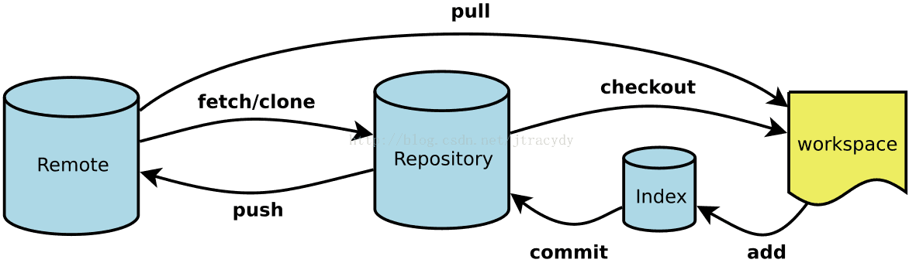

# Git

### 学习文档

https://git-scm.com/book/en/v2

### 起步




git将文件的存储划分为三个区域，分别为**本地的工作区**、**本地的版本区（其中版本区又划分出暂存区与主存区）**、以及**远程主机上的origin区**。

为什么会额外地划分一个暂存区？

类似于购物网站中的收藏夹，当我们在工作区修改、更新大量的文件时，而我们又不能确定哪些文件是确定修改的，此时暂存区就彰显了它的作用所在，它可以将确定修改的文件集合然后一次提交。

### 下载

通过上面的链接下载 git，通常会带有 git 中的 bash 窗口，通过 bash 窗口配置用户身份信息。

```shell
git config --user.name 'zhangsan'
git config --user.email 'youremail@example.com'
```

### 建立连接

git 本地与远程需要建立 SSH 密钥连接。类似于口令，远程与本地需要密码才能安全对接。

```shell
ssh-keygen -t rsa -C 'youremail@example.com'    创建本地密钥
cat ~/.ssh/id_rsa.pub       查看本地密钥
```

将命令行密钥复制后粘贴到远程github创建的密钥中，远程密钥在settings/SSH and GPG keys中创建，至此整个口令完成。

### 常用命令语句

```shell
### 将文件添加到暂存区

git add filename # 单独提交文件
git add -A # 提交所有变化
git add -u  # 提交被修改（modified）和被删除（deleted）文件，不包括新文件（new）
git add . # 提交新文件（new）和被修改的（modefied）文件，但不包括被删除（deleted）文件

git status # 查看本地工作区与暂存区的差别

git commit -m "修改了一个bug" # 将文件提交到主存区并留言
git commit -a -m "修改了一个bug" # 将文件直接提交并留言

git push # 将文件提交到远程主机，第一次需要配置远程主机名

git remote rm origin # 删除远程仓库

### 分支代码
git fetch # 拉取其余分支到仓库
git branch -a # 查看仓库所有分支
git checkout <分支名> # 切换分支

### merge 解释
git merge # 合并远程分支
git merge <分支名> # 将本地分支合并到当前所在分支
```

### 案例

在 github 或托管网站上创建仓库，一般会提示接下来的提交步骤（如github），不清楚可参考一下提交代码：

**第一次提交步骤：**

- 创建本地文件，对该文件添加 .git 控制

```shell
git init
```

- 将该文件添加到本地仓库

```shell
git add -A
git commit -m"第一次提交文件"
```

- 创建远程仓库，生成SSH密钥，并与本地仓库建立连接。

```shell
git remote add origin yourlibarary@example.com
```

- 提交

```shell
git push -u origin master
```

**可能出现的问题：**

如果第一次提交，本地项目和远程仓库项目不一致，可能会报错`Updates were rejected because the remote contains work...`

这个时候需要在**提交**前，拉取一下远程仓库：

```shell
git pull origin master  ## 拉取远程仓库到本地
```

如果出现以下错误`Git :fatal: refusing to merge unrelated histories`

也就是说远程仓库和本地仓库具有不同的提交历史，那么我么可以运行不相关历史提交，强制合并代码，从而解决该问题：

```shell
git pull origin master --allow-unrelated-histories
```


**之后提交步骤：**

```shell
git add -A
git commit -m"第二次提交文件"
git push
```


### 分支

如果我们想在本地创建一个分支，使用如下命令：

- 创建分支

```shell
git branch <分支名>
```

当我们在分支上做了一定修改时，在提交到远程时，需要添加远程映射分支：

- 添加远程分支

```shell
# git add -A
# git commit -m"创建新分支"
git push --set-upstream origin <本地分支名>
```

查看本地分支：


- 查看分支

```shell
git branch -a
```
如果本地没有其他分支，很大情况下，意味着我们并没有将其他分支拉取到本地仓库，需要使用如下命令：

- 拉取分支

```shell
git fetch
```

- 切换分支（dev为分支名）

```shell
git checkout dev
```

#### 冲突

当远程仓库改变，而本地仓库并没有发生更改，比如我们在多人开发应用的时候。这个时候我们需要把远程代码拉取到本地仓库，处理冲突，之后才能进行提交：

- 将工作区域提交到本地仓库

```shell
git add -a
git commit -m"test"
```

- 拉取远程代码

```shell
git pull
```

一般这个时候，编译器（如VSCode）会自动高亮显示冲突代码，我们可以手动进行更改冲突，更改完后进行提交。

#### 合并

比如我们在一个分支上开发留言板，开发了一半，业务突然下发，说需要修复一下master主分支上的一个bug，我们当然不能直接在master上面进行操作，这个时候就可以新建一个分支。

- 新建分支

```shell
git branch <分支名>
```

在该分支开发完毕后，将该分支合并到master分支：

- 合并分支

```shell
# 切换到主分支
# git checkout master
# 合并分支
git merge <分支名>
```


### .gitignore文件

该文件用来控制项目中的上传文件。如 node_modules

- 使用说明
  - https://blog.csdn.net/jiandan1127/article/details/81205530

### 常见问题

- 拒绝访问：permission denied(public key) ?

  - 要么本地没有远程密钥（通过命令行`ssh -T git@github.com`可以查看是否存在），若存在将密钥复制到远程密钥中，若不存在通过`ssh-keygen -t rsa -C 'youremail@example.com'`创建。

  - 也可以通过`cat ~/.ssh/id_ras.pub`查看密钥在本地的绝对路径，一般位于：c:/administrator/.ssh文件下，其中id_rsa.pub是公钥，id_rsa是私钥

- 如果子目录存在.git文件，那么提交到github中的文件为空。

  - 如果依旧不行，那证明主目录中的.git已经默认忽略子目录了。这个时候可以删除主目录的.git文件，然后重新与远程仓库建立连接。

    由于远程仓库原本已经有了本地连接，此刻需要将连接覆盖掉。

     `git push origin master -f`

- 不使用ssh的方式，但每次提交代码都不需要输入用户名和密码
  
  - https://jingyan.baidu.com/article/4b07be3cf27d8148b280f36a.html