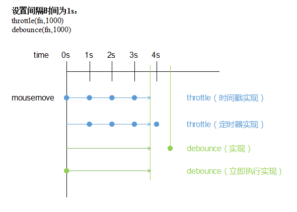

### 节流和防抖

在前端开发中，我们通常会遇到一些频繁的事件触发，如：

- window 的 resize、scroll
- mousedown、mounsemove
- keyup、keydown

下面用一个小案列来演示一下如何频繁的触发事件：

```html
<!DOCTYPE html>
<html lang="zh">
<head>
    <meta charset="utf-8">
    <meta http-equiv="x-ua-compatible" content="IE=edge, chrome=1">
    <title>节流和防抖</title>
    <style>
        #container{
			width: 100%;
			height: 200px;
			line-height: 200px;
			background-color: #555;
			color: #fff;
			text-align: center;
		}
    </style>
</head>

<body>
    <div id="container"></div>
</body>
<script>
	var count = 1
	var container = document.querySelector('#container')
	function add(){
		contaienr.innerHTML = count++
	}
	container.onmousemove = add
</script>
</html>
```

可以看见，当在 container 元素中移动鼠标，会频繁触发add函数。那怎么才能降低这种频繁触发函数的行为呢，这就要提到两种方案，**节流和防抖**。

节流（throttle），在规定的时间里，用户只能触发一次事件函数。

防抖（debounce），用户行为结束后，在规定的时间才开始触发一次事件函数。

图解说明：




你不要立马搞懂这张图，当看完所有代码后，再回过头看这种图，对于节流和防抖，相信你会有更清晰的认知。


### 节流

节流（throttle），在规定的时间里，用户只能触发一次事件。节流有两种实现：

- 时间戳，在规定时间的起始位置触发事件
- 定时器，在规定事件的结束位置触发事件

#### 事件戳

时间戳实现原理：

- 定义初始时间变量为0
- 获取用户触发事件时的时间戳
- 将该时间戳减去初始时间
  - 如果大于规定的时间，则执行事件函数，并将初始时间设置为当前时间戳

```javascript
function throttle(fn,interval){
    var last = 0
    return function(){
        var context = this
        var args = arguments
        
        var now = +new Date()
        if(now - last > interval){
            fn.apply(context,args)
        }
    }
}
```

那么至此最开始频繁触发事件的代码就可以改写成下面代码：

```javascript
container.onmounsemove = throttle(add,1000) // 每隔1秒钟触发一次add函数
```

#### 代码解释

`+new Date()`：获取时间戳（这里有个隐形转换），也可以通过`Date.now()`获取

`var context = this`：将事件函数的this绑定到DOM元素上

`var args = arguments`：将传递给函数的事件对象传递给处理函数

如果对于以上的解释，你还不是足够清楚的话，那么请浏览下面的试题代码：

```javascript
// 改写add函数 打印this和event
var count = 1
var container = document.querySelector('#container')
function add(){ 
	contaienr.innerHTML = count++
    console.log(this)
    console.log(event)
}
```

```javascript
// 改写throttle
function throttle(fn,interval){
    var last = 0
    return function(){
        var now = +new Date()
        if(now - last > interval){
            fn()
        }
    }
}
```

```javascript
// 轮流注释下列代码进行查看
// 不使用节流
container.onmousemove = add // this指向container event为mousemove的事件对象
// 使用节流
container.onmousemove = throttle(add,2000) // this指向window event为undefined
```

之所以出现这种情况，是因为我们将 add 函数赋值给 fn 形参，在执行 fn 函数的时候并没有被任何对象调用，所有此刻 add 函数中的 this 执行 window，fn 并未定义参数，也就不会有 event 事件对象。

#### 定时器

除了时间戳的实现，节流还有另一种实现，也就是利用定时器进行实现：

定时器实现原理：

- 定义定时器变量
- 如果定时器不存在，即执行以下代码
  - 启动`timeout`并给定时器变量赋值
    - 执行函数代码
    - 清除定时器

```javascript
function throttle(fn,interval){
    var timer
    return function(){
        var context = this
        var args = arguments
        if(!timer){
            timer = setTimeout(function(){
                fn.apply(context,args)
                timer = null
            },interval)
        }
    }
}
```

