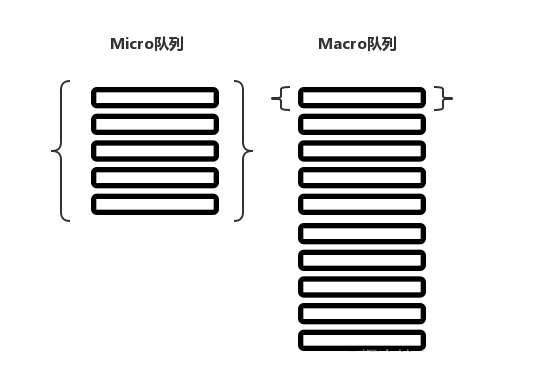

# Js运行机制

我们知道JS代码分为同步和异步，异步代码又包括Macro-Task（宏任务）和Micro-Task（微任务）。

### 宏任务和微任务

事件循环中的异步队列有两种：macro（宏任务）队列和 micro（微任务）队列。

常见的 macro-task 比如： setTimeout、setInterval、 setImmediate、script（整体代码）、 I/O 操作、UI 渲染等。
常见的 micro-task 比如: process.nextTick、Promise、MutationObserver 等。

### 异步代码解析

关于macro task 和 micro task 的执行顺序，用以下代码就可以解释：

```javascript
for (macroTask of macroTaskQueue) {
    // 1. Handle current MACRO-TASK
    handleMacroTask();
      
    // 2. Handle all MICRO-TASK
    for (microTask of microTaskQueue) {
        handleMicroTask(microTask);
    }
}
```

假设程序产生了下图所示的两个队列，那么程序首先执行一个 macro 任务，之后清空所有的 micro 队列。



以下面代码做说明：

```html
<script> // 宏任务
console.log('这是第一个script')

console.log('hello')
setTimeout(()=> {
  console.log('宏任务')
},0)
Promise.resolve().then(() => {
  console.log('微任务1')
})
console.log('world')
</script>
<script> // 宏任务
  console.log('这是第二个script')
  Promise.resolve().then(() => {
  console.log('微任务2')
})
</script>
```

宏任务队列：

	- 第一个script
	- 第二个script

执行第一个script：

- 顺序执行，**这是第一个script**

- 顺序执行，**打印hello**

- setTimeout：产生一个宏任务队列，即在第二个script后面
- Promise：产生一个微任务
- 顺序执行，**打印world**

第一个script执行完毕。

清空所有微任务队列：

- Promise，**打印微任务1**

执行第二个宏任务（第二段script代码）

- **打印，这是第二个script**

- Promise：产生一个微任务

第二个script执行完毕。

清空所有微任务队列：

- Promise，**打印微任务2**

执行第三个宏任务：

- setTimeout：**打印宏任务**
