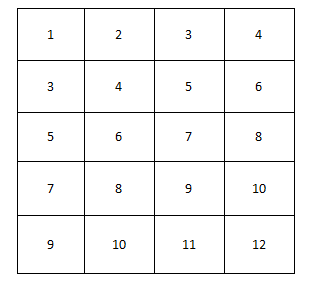

# 数组

### 二维数组中的查找

#### 题目描述

在一个二维数组中（每个一维数组的长度相同），每一行都按照从左到右递增的顺序排序，每一列都按照从上到下递增的顺序排序。请完成一个函数，输入这样的一个二维数组和一个整数，判断数组中是否含有该整数。

#### 基本示意图



#### 思路

**第一种：**

从上到下，从左到右，遍历每一个元素，然后和该整数做对比，如果相同则返回true，如果不相同则返回fasle。

该算法时间复杂度较高，O = n^2

**第二种：**

利用二维数组由上到下，由左到右，递增的规律。

选取左下角或右上角的元素`a[i][j]`，然后与目标数对比。以左下角元素为例，如果大于目标数，则目标数在该数右边，即`i++`，如果小于目标数，则在该数上边，即`j--`。

该算法时间复杂度：0 ~ max(a.length,a[0].length)

#### JavaScript实现

```javascript
// 第一种
function find(target,array){
    for(var i = 0; i < array.length; i++){
        for(var j = 0; j < array[0].length; j++){
            if(target == array[i][j]){
                return true
            }
        }
    }
    return false
}
```

```javascript
// 第二种:以左下角数为例
function find(target,array){
    let row = array[0].length - 1
    let col = 0
    while(row >= 0 && col <= array.length - 1){
        if(array[col][row] == target){
            return true
        }
        else if(array[col][row] > target){
            row--
        }
        else{
            col++
        }
    }
    return false
}
```

#### JAVA实现

```java
// 第一种实现
public class Solution {
    public boolean Find(int target,int [][] array){
        for(int i = 0;i < array.length; i++){
            for(int j = 0; j < array[0].length; j++){
                if(target == array[i][j]){
                    return true;
                }
            }
        }
        return false;
    }
}
```

```java
// 第二种实现
public class Solution {
    public boolean Find(int target,int [][] array){
        int row = array[0].length - 1;
        int col = 0;
         while(row >= 0 && col <= array.length - 1){
            if(array[col][row] == target)
                return true;
            else if(array[col][row] > target)
                row--;
            else
                col++;
        }
        return false;
    }
}
```


### 数组找重

#### 题目描述

在一个长度为n的数组里的所有数字都在 0 到 n-1 的范围内。数组中某些数字是重复的，但不知道有几个数字是重复的。也不知道每个数字重复几次。请找出数组中任意一个重复的数字。例如，如果输入长度为7的数组{2，3，1，0，2，5，3}，那么对应的输出是一个重复的数字2。

```javascript
function duplicate(numbers, duplication){
    // numbers为遍历数组，duplication为重复的值
    // 找到任意重复的一个值，并赋值到duplication[0]
    // 函数返回 true / false
}
```


#### 思路

该题描述不清，到底是随便的输出重复的数字，还是判断该数组是否有重复的数字。经过后续解题人的思路得知，为判断该数组是否有重复的数字。

那么思路如下：

1、哈希：

- 创建另一个hash数组，初始化hash数组，将所有的值赋值为0。
- 遍历当前数组，将该数组的值作为hash数组的下标，如果下标相同，对应的值加一。
- 如果对应的值大于1，那么将hash下标也就是遍历数组的值赋值给duplication，并返回true
- 如果没有找到，最终返回fasle

#### JavaScript实现

```javascript
function duplicate(numbers, duplication)
{
    // write code here
    //这里要特别注意~找到任意重复的一个值并赋值到duplication[0]
    //函数返回True/False
    let hash = []
	// 初始化hash
    for(var i = 0; i < numbers.length; i++){
        hash[i] = 0
    }

    for(var i = 0; i < numbers.length; i++){
        hash[numbers[i]] ++
        if(hash[numbers[i]] > 1){
            duplication[0] = numbers[i]
            return true
        }
    }
    return false
}
```

```javascript
function duplicate(numbers, duplication)
{
    // write code here
    //这里要特别注意~找到任意重复的一个值并赋值到duplication[0]
    //函数返回True/False
    let hash = []

    for(var i = 0; i < numbers.length; i++){
        if(hash[numbers[i]] == 1){
            duplication[0] = numbers[i]
            return true
        }
        hash[numbers[i]] = 1
    }
    return false
}
```

