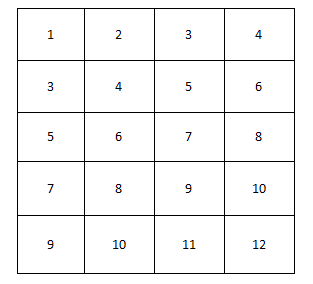

# 数组

### 二维数组中的查找

#### 题目描述

在一个二维数组中（每个一维数组的长度相同），每一行都按照从左到右递增的顺序排序，每一列都按照从上到下递增的顺序排序。请完成一个函数，输入这样的一个二维数组和一个整数，判断数组中是否含有该整数。

#### 基本示意图



#### 思路

**第一种：**

从上到下，从左到右，遍历每一个元素，然后和该整数做对比，如果相同则返回true，如果不相同则返回fasle。

该算法时间复杂度较高，O = n^2

**第二种：**

利用二维数组由上到下，由左到右，递增的规律。

选取左下角或右上角的元素`a[i][j]`，然后与目标数对比。以左下角元素为例，如果大于目标数，则目标数在该数右边，即`i++`，如果小于目标数，则在该数上边，即`j--`。

该算法时间复杂度：0 ~ max(a.length,a[0].length)

#### JavaScript实现

```javascript
// 第一种
function find(target,array){
    for(var i = 0; i < array.length; i++){
        for(var j = 0; j < array[0].length; j++){
            if(target == array[i][j]){
                return true
            }
        }
    }
    return false
}
```

```javascript
// 第二种:以左下角数为例
function find(target,array){
    let row = array[0].length - 1
    let col = 0
    while(row >= 0 && col <= array.length - 1){
        if(array[col][row] == target){
            return true
        }
        else if(array[col][row] > target){
            row--
        }
        else{
            col++
        }
    }
    return false
}
```

#### JAVA实现

```java
// 第一种实现
public class Solution {
    public boolean Find(int target,int [][] array){
        for(int i = 0;i < array.length; i++){
            for(int j = 0; j < array[0].length; j++){
                if(target == array[i][j]){
                    return true;
                }
            }
        }
        return false;
    }
}
```

```java
// 第二种实现
public class Solution {
    public boolean Find(int target,int [][] array){
        int row = array[0].length - 1;
        int col = 0;
         while(row >= 0 && col <= array.length - 1){
            if(array[col][row] == target)
                return true;
            else if(array[col][row] > target)
                row--;
            else
                col++;
        }
        return false;
    }
}
```


